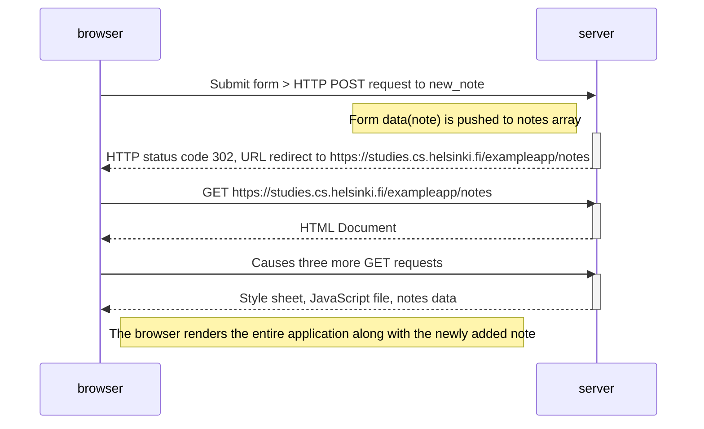

```mermaid
sequenceDiagram
    participant browser
    participant server

    browser ->> server: Submit form > HTTP POST request to new_note
    Note left of server: Form data(note) is pushed to notes array
    activate server
    server -->> browser: HTTP status code 302, URL redirect to https://studies.cs.helsinki.fi/exampleapp/notes
    deactivate server

    browser ->> server: GET https://studies.cs.helsinki.fi/exampleapp/notes

    activate server
    server -->> browser: HTML Document
    deactivate server

    browser ->> server: Causes three more GET requests

    activate server
    server -->> browser: Style sheet, JavaScript file, notes data
    deactivate server

    Note right of browser: The browser renders the entire application along with the newly added note
```
